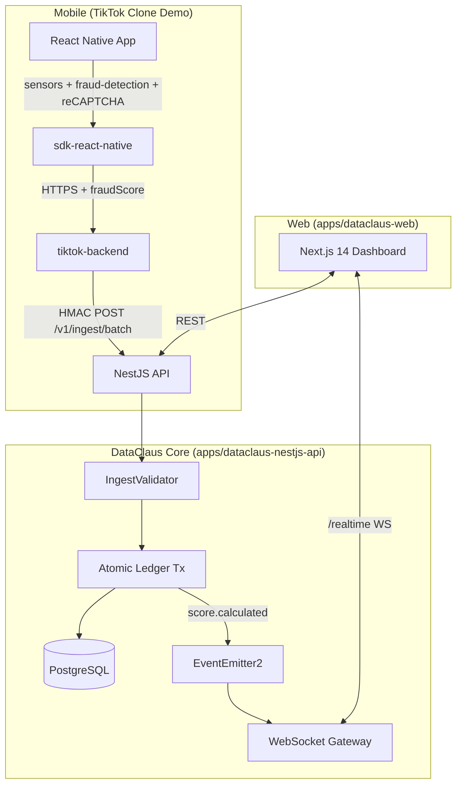

# DataClaus — Real-Time Mobile Data Monetization Platform

> **Big Tech Knows When You're Awake. We Make Sure You Get Paid for It.**

DataClaus is a NestJS + Next.js platform that converts behavioral signals
generated by mobile users into transparent, verifiable, real-time payouts —
shared between the user, the app developer, and the platform.

A shake of a phone in our demo TikTok-clone produces a fraud-scored event,
an atomic double-entry ledger transfer, and a live wallet balance update on
the dashboard within seconds.

---

## Quick start (≈10 minutes)

```bash
# 1. Clone & enter
git clone <repo-url>
cd data_claus-monorepo

# 2. Configure environment (sane localhost defaults)
cp .env.example .env  # if present, otherwise skip

# 3. Start infrastructure (Postgres + Kafka)
docker-compose up -d

# 4. Install all workspaces (pnpm at root, npm inside individual apps)
pnpm install

# 5. Boot the API once so TypeORM creates the schema
cd apps/dataclaus-nestjs-api && pnpm install && pnpm run start:dev
# wait for "Application is running on http://localhost:3000"
# then Ctrl+C and return to repo root

# 6. Seed predictable demo data
pnpm run demo:seed       # writes JURY_LOGIN.md at the repo root

# 7. Launch everything
pnpm run dev:all          # api + web + tiktok-backend + tiktok-mobile

# 8. Open the jury console
open http://localhost:3001/jury
```

Use the **Demo Login** buttons; password is `demo1234` for every account.

---

## Architecture (capstone scope)



Key invariant: `SUM(amount) WHERE status='completed' = 0` over the
`ledger_transactions` table at all times. Verified by a cron and exposed
via the `/admin/health/full` endpoint.

---

## Repo layout

```
data_claus-monorepo/
├── apps/
│   ├── dataclaus-nestjs-api/   NestJS REST + WS + ingest core
│   ├── dataclaus-web/          Next.js 14 dashboard (developer/user/buyer/admin)
│   ├── tiktok-backend/         Node demo backend that proxies SDK -> API (HMAC)
│   └── tiktok-mobile/          Expo React Native demo
├── packages/
│   ├── sdk-react-native/       Mobile SDK (sensors, fraud, identity, ads)
│   └── sdk-node/               Server SDK (HMAC client, auth helper)
├── scripts/
│   ├── demo-seed.ts            Idempotent demo data seeder
│   ├── demo-replay.ts          Live impression generator (every 5s)
│   └── demo-reset.ts           Truncate + reseed
├── docs/
│   ├── presentation/           Slide deck, QA prep, demo-day checklist
│   └── runbook/                Troubleshooting playbooks
└── memory-bank/                Living spec & implementation plans
```

---

## Phase status

The project is broken into 7 phases. Detailed plans live in
`memory-bank/implementation/`. High-level status (April 2026):

| Phase | Title | Status |
|-------|-------|--------|
| 1 | Ingest Pipeline (HMAC + scored_events) | ✅ |
| 2 | Financial Integrity (atomic ledger + invariant) | ✅ |
| 3 | Auth & Security (OTP, reCAPTCHA, throttling, webhooks) | ✅ |
| 4 | Realtime / WebSocket | ✅ |
| 5 | User Portal (earnings, withdraw, KVKK) | ✅ |
| 6 | Marketplace & Buyers | partial |
| 7 | **Demo polish & capstone delivery** | this branch |

See [`memory-bank/implementation/00-master-plan.md`](memory-bank/implementation/00-master-plan.md)
for the full roadmap.

---

## Operational scripts (`pnpm run …`)

| Script         | What it does |
|----------------|--------------|
| `demo:seed`    | Predictable demo data (3 devs, 5 users, 2 buyers, 3 campaigns, 100 impressions). Idempotent. |
| `demo:replay`  | Generates one ad impression every 5s so dashboards animate during a live demo. |
| `demo:reset`   | Truncates demo tables and reseeds. Refuses to run when `NODE_ENV=production`. |
| `dev:api`      | NestJS API in watch mode. |
| `dev:web`      | Next.js dashboard in dev mode. |
| `dev:tiktok-be` | TikTok demo backend in watch mode. |
| `dev:tiktok-mb` | Expo metro bundler for the mobile demo. |
| `dev:all`      | All four above, color-coded via `concurrently`. |

---

## Troubleshooting

Common issues + fixes live in [`docs/runbook/`](docs/runbook/):

- `ingest-rejecting-everything.md`
- `migration-out-of-sync.md`
- `websocket-not-connecting.md`
- `webhook-deliveries-failing.md`
- `ledger-invariant-broken.md`

---

## Capstone & licensing

DataClaus is a final-year capstone project. Source is MIT-licensed at the
monorepo root unless individual apps state otherwise. Demo credentials are
non-production and committed only to `JURY_LOGIN.md` (auto-generated, not
checked in).

For the full vision, philosophy, and product narrative see
`memory-bank/projectbrief.md` and `memory-bank/philosophy.md`.
