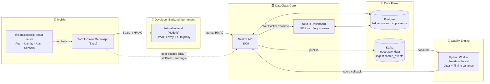
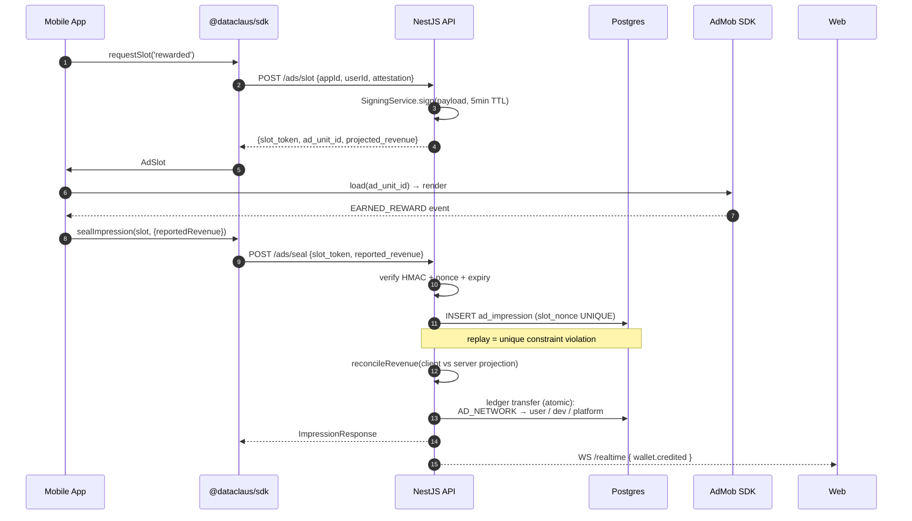
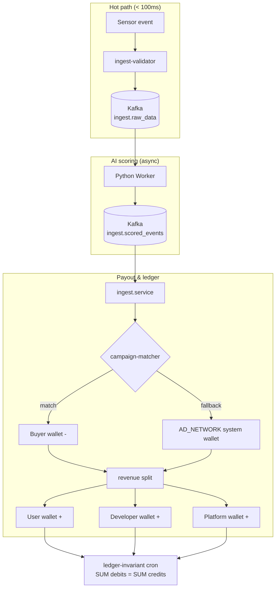
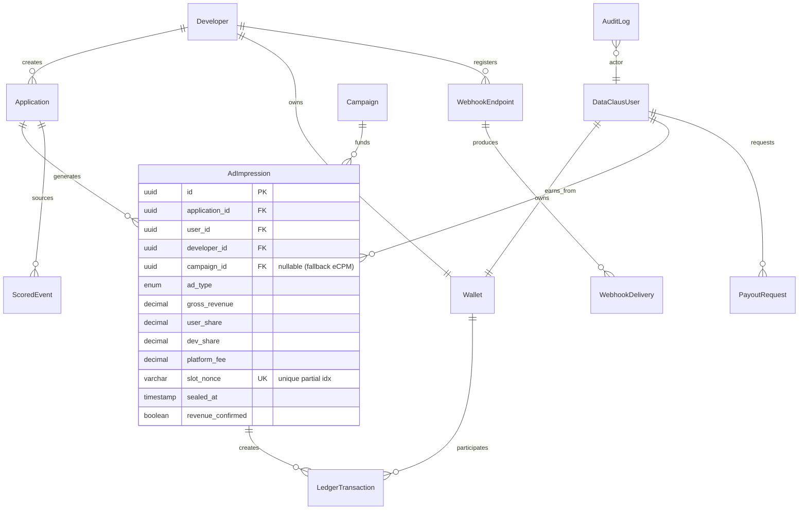

# DataClaus — System Architecture

> Capstone-scope architecture overview. Mermaid diagrams render natively on
> GitHub and most documentation viewers (mkdocs, Notion, GitLab).

---

## 1. High-Level Component Map

**Key boundaries:**
- **Mobile SDK** never holds an app's HMAC secret — it goes through the
  developer's own backend (`tiktok-backend`) for HMAC-required ingestion
  flows. User-scoped REST (slot/seal, earnings) goes direct with a Bearer
  token.
- **Kafka** is the buffer between hot-path ingestion (sub-100ms) and the
  Python worker (seconds to minutes). API never blocks on AI scoring.
- **Ledger** (Postgres) is the source of truth for every cent. Double-entry
  invariant cron validates it.

---

## 2. Slot/Seal Impression Flow (Anti-Bypass)

**Defense layers (in order of triggering):**
1. JWT bearer → caller authenticated
2. App-id binding in slot payload → token can't move between apps
3. HMAC-SHA256 verify → tampered payload rejected
4. Expiry check → 5min TTL kills harvested tokens
5. In-memory nonce ledger → intra-process replay rejected
6. DB `slot_nonce` unique partial idx → cross-process / post-restart replay rejected
7. Revenue reconciliation → clamp + suspicious flag if client lies

---

## 3. Data Pipeline (Ingest → Score → Payout)

---

## 4. Entity / Domain Map

---

## 5. Security Model (Per-Layer)

| Layer | Threat | Control |
|-------|--------|---------|
| Mobile SDK | Forked SDK fakes revenue | Server resolves ad-unit + revenue |
| API ingress | Replay attack | HMAC + nonce + DB unique idx |
| API ingress | Brute force | `ThrottlerModule` 10/sec + 100/min |
| Auth | OTP enumeration | reCAPTCHA Enterprise + per-phone rate limit |
| Ledger | Race condition / partial commit | TypeORM transaction + `ledger-invariant` cron |
| KVKK / GDPR | Data subject access | `/dsar` module |
| KVKK / GDPR | Audit trail | `audit.interceptor` + `AuditLog` entity |
| Webhook delivery | MITM tampering | HMAC-signed payloads + secret rotation |

---

## 6. Out of Capstone Scope

- **Buyer portal UI** — economics simulated via `campaign-matcher.service`
- **Real Stripe Connect** — payouts simulated, regulatory work out of scope
- **Production attestation** — App Attest / Play Integrity stub (host app
  registers real provider in production)
- **Multi-network ad mediation** — AdMob only; AppLovin / Unity Ads
  roadmap'te
- **Production observability stack** — Sentry / Datadog hook'lar mevcut
  (`SENTRY_DSN` env), wiring deployment fazına bırakıldı

---

*Generated as part of capstone deliverables. For runbook see
`docs/runbook/`. For poster layout see `POSTER.md`.*
