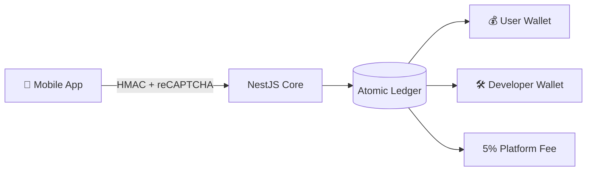

<!--
Marp / Reveal.js compatible deck. 12 slides, 7 minutes.
Build PPTX/PDF via `npx @marp-team/marp-cli docs/presentation/slides.md`.
-->

# DataClaus

**Big Tech Knows When You're Awake.**
**We Make Sure You Get Paid for It.**

A real-time mobile data monetization platform.

---

## The problem

- Surveillance capitalism extracts data from billions of users — and pays
  them nothing.
- Indie developers can't credibly compete with ad platforms that own both
  the audience and the meter.
- "Where does my data go?" has no auditable answer.

---

## The solution

**One pipeline.** From a sensor event to three wallets, transparently and
in real time.

---

## "Quality = Money"

A signal generated by a real human is worth a measurable amount. A signal
generated by a bot is worth nothing.

- **Client-side:** SDK fraud detection (motion, sensors, emulator probes,
  reCAPTCHA Enterprise).
- **Server-side:** anomaly checks, replay guard, per-user rate-limit.
- **Outcome:** every payout multiplier is `qualityScore = 1 - fraudScore`.

---

## LIVE — Dashboard tour

> Open `/jury` → "Login as Developer Demo".

- Application list with **per-app revenue share** (60% / 70% / 85%).
- Wallet view with $0.00 baseline.
- Real-time graphs idling at zero.

---

## LIVE — Phone shake → SDK flow

> Hand the phone to the jury volunteer.

- Open the TikTok Clone, scroll, shake.
- Backend log streams: HMAC verified, `fraudScore=0.12`,
  `qualityScore=0.88`, `payout=$0.0023`.
- Confirm `scored_events` count is climbing.

---

## LIVE — Wallet & withdraw

> Switch back to the dashboard.

- Watch user wallet balance increment in real time over WS.
- Click **Withdraw** — atomic ledger transaction is recorded.
- Open `/admin/health/full` — `Ledger invariant: SUM = 0` ✅.

---

## Architecture deep-dive (30 sec)

- **HMAC** request signing on every ingest batch.
- **EventEmitter2** in-process bus → WebSocket gateway.
- **Double-entry ledger** — every credit has a paired debit.
- **Outbox pattern** for webhooks (atomic with the ledger insert).

---

## Quality engine

7-layer fraud detection in the SDK plus reCAPTCHA Enterprise risk score:

1. Touch event entropy
2. Accelerometer/gyroscope coherence
3. Emulator/jailbreak detection
4. Network signal sanity
5. Session timing patterns
6. App switching cadence
7. reCAPTCHA Enterprise score

The server is the final filter — never trust a single layer.

---

## Roadmap

- **Phase 6** marketplace: data buyers, campaign auctions.
- Pure-SDK mobile drop (no demo backend in the path).
- Production rails: Kafka, Stripe live mode, multi-region Postgres.
- KVKK/GDPR: DSAR endpoint live, retention policies in `/legal/data-rights`.

---

## Tech stack

- **Backend:** NestJS 11, TypeORM, PostgreSQL, Socket.IO, EventEmitter2.
- **Frontend:** Next.js 14 App Router, Tailwind, Tan-stack Query.
- **Mobile:** Expo, React Native, custom sensor SDK.
- **Infra:** Docker Compose (Postgres + Kafka), Vercel-style Next deploy.

---

## Q&A

**Code:** github.com/&lt;org&gt;/data_claus-monorepo
**Live demo:** localhost:3001/jury (password `demo1234`)
**Architecture:** `memory-bank/implementation/00-master-plan.md`
**Runbook:** `docs/runbook/`

Thank you.
