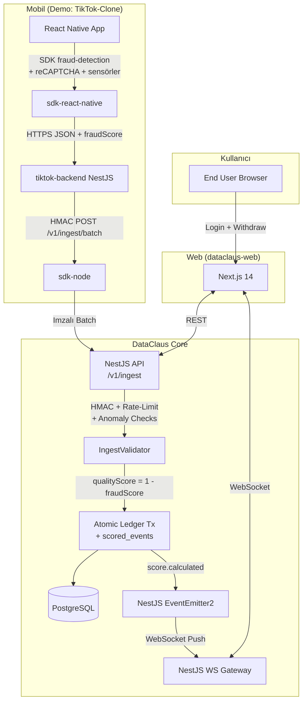

# 00 — Master Plan (Yol Haritası)

> **Felsefik Çerçeve:** DataClaus, "Gözetim Kapitalizmi"ne karşı geliştirilen, kullanıcının zamanını/verisini değere çeviren ve indie geliştiricilere dev şirketlere karşı **gelir paylaşımı** silahı veren bir platform/SDK'dır. (Bkz. `philosophy.md`)
>
> **Capstone Başarı Kriteri:** Telefon sallandığında dashboard grafikleri ve kullanıcı cüzdan bakiyesi **gerçek zamanlı** artar. (Bkz. `projectbrief.md`)
>
> **Mimari Karar (28 Nisan 2026):** Bot/insan ayrımı **client-side SDK fraud-detection + reCAPTCHA Enterprise + server-side anomaly checks** kombinasyonu ile yapılır. **Python AI Worker scope'tan çıkarıldı** (post-capstone faz). **Kafka opsiyonel** kategoride; capstone'da NestJS in-process EventEmitter yeter.

---

## 1. Hedef Mimari (Tam Veri Akışı)



> **Not:** Kafka container `docker-compose.yaml`'de hazır kalır ama capstone akışında **kullanılmaz**. Phase 8+ scale ihtiyacı doğduğunda EventEmitter → Kafka geçişi kolaydır (aynı topic adlandırması).

## 2. Mevcut Durum Özeti (28 Nisan 2026)

### ✅ Var ve Çalışıyor
- NestJS API çekirdek modülleri: `auth`, `developer`, `application`, `wallet`, `campaign`, `ledger`, `ads`, `analytics`, `dataclaus-user`, `admin`.
- HMAC guard sınıfı (`common/guards/hmac.guard.ts`) — **fakat kullanıldığı endpoint yok**.
- React Native SDK: sensör toplama, fraud-detection (client-side), reCAPTCHA, identity, ads, auth modülleri.
- Node SDK: HMAC client, auth helper.
- TikTok demo: `tiktok-backend` (NestJS proxy) + `tiktok-mobile` (Expo).
- Web dashboard: çoklu rol (developer / user / buyer / admin), revenue share slider, wallet sayfaları.
- Docker Compose: Postgres + Kafka + Kafka UI **ayakta** (ama Kafka **kullanılmıyor**).

### ❌ Yok / Yarım (Doğrulanmış False Claim'ler)
| Konu | `progress.md` Diyor | Gerçek | Plan |
|------|---------------------|--------|------|
| AI Worker (Python, Isolation Forest) | ✅ "Running" | **Dosya yok** | **Scope dışı** — SDK fraud-detection yeterli |
| Kafka entegrasyonu | ✅ "Active" | NestJS'te kullanılmıyor | **Opsiyonel** — capstone'da EventEmitter yeter |
| Ingest endpoint (`/v1/ingest`) | (varsayılan) | **Hiç controller yok**, HMAC guard `@UseGuards` ile aktif değil | Phase 1'de yazılır |
| Webhook system | aktif konsept | Servis/Entity/Dispatcher yok | Phase 3 |
| OTP authentication | plan | Sadece email+password var | Phase 3 |
| WebSocket real-time | "Next step" | Hiç gateway yok | Phase 4 |
| Transaction atomicity | "Double-Entry" | `@Transaction` yok — race condition riski | Phase 2 |
| Withdraw / Payout | konsept | Kullanıcı tetikleyebileceği akış yok | Phase 2 |

> Bu liste, plan dosyalarının her birinde "Mevcut Durum" başlığıyla tekrar doğrulanır.

## 3. Faz Bağımlılık Grafiği

```
┌─────────────────────────────────────────────────────────────────┐
│                                                                 │
│   Phase 1 (Data Pipeline) ──┬── Phase 2 (Financial Integrity)  │
│                             │                                   │
│                             ├── Phase 4 (Realtime/WS)          │
│                             │                                   │
│   Phase 3 (Auth/Security)  ─┘                                   │
│                                                                 │
│   Phase 5 (User Portal) ── needs Phase 2                       │
│                                                                 │
│   Phase 6 (Marketplace) ── needs Phase 1 + Phase 2             │
│                                                                 │
│   Phase 7 (Demo/Polish) ── needs ALL                           │
│                                                                 │
└─────────────────────────────────────────────────────────────────┘
```

**Critical Path:** `1 → 2 → 4 → 7` (data → para → görünür → demo).
Phase 3 paralel çalışabilir; Phase 5 ve 6 isteğe bağlı (capstone için 5 zorunlu, 6 opsiyonel).

## 4. Felsefe ↔ Faz Eşlemesi

| Felsefik Vaat (`philosophy.md`) | Hangi Faz Karşılar |
|---------------------------------|--------------------|
| "Gerçek insanın eli titrer, botlar sabittir" | **SDK fraud-detection** (zaten var) + **Phase 1** server-side validation |
| "Yoktan para var edilemez" — double-entry | **Phase 2** — Atomic ledger transactions |
| "Geliştiricilere dev şirketlere karşı güçlü silah" | **Phase 5+6** — Withdraw + Marketplace |
| "Verinin/zamanın bedeli vardır" — kullanıcı kazanır | **Phase 4** — Canlı bakiye artışı (görsel kanıt) |
| "İndie etik rakip" — şeffaf gelir paylaşımı | **Phase 5** — Public earnings ledger sayfası |
| "Kalite=para" | **Phase 1** — `qualityScore = 1 - fraudScore` → payout multiplier |

## 5. Sunum / Demo Akışı (Capstone Jüri Önünde)

> 7 dakikalık demo senaryosu. Her dakikada hangi fazın hangi parçası gösterilir:

```
00:00–00:30  Vizyon slide'ı (philosophy özeti)
00:30–01:30  Web dashboard turu (Phase 5 + 6'nın görünümü)
01:30–03:00  Telefon (TikTok-clone) açılır, login (Phase 3 OTP)
03:00–04:30  Telefon SALLANIR + scroll edilir → SDK akışı (Phase 1)
04:30–05:30  Backend log akar (HMAC verified, fraudScore=0.12, qualityScore=0.88, payout=$0.0023)
05:30–06:30  Web dashboard'da grafikler ANINDA güncellenir (Phase 4)
06:30–07:00  Withdraw butonu, ledger doğrulaması (Phase 2 + 5)
```

Bu akışın her adımı bir fazın acceptance criteria'sı olarak yansır.

## 6. Risk Matrisi

| Risk | Etki | Olasılık | Azaltma | Faz |
|------|------|----------|---------|-----|
| SDK fraud-detection bypass (jailbreak telefon) | Yüksek | Düşük | reCAPTCHA Enterprise (Phase 3) ek katman | 1 + 3 |
| Server-side replay attack | Yüksek | Orta | `eventId UNIQUE` index + replay guard | 1 |
| Race condition → çift kredite | Çok Yüksek | Düşük | Atomic transaction + ledger invariant cron | 2 |
| OTP sağlayıcı entegrasyonu yetişmez | Orta | Yüksek | Console-log fallback (capstone modu) | 3 |
| WebSocket reconnect demo'da sorun çıkarır | Orta | Düşük | Heartbeat + auto-reconnect | 4 |
| Demo seed data yetersiz, ekran boş görünür | Yüksek | Orta | Phase 7'de scripted seeder | 7 |
| Sunum öncesi sentetik trafik gerekir | Orta | Yüksek | Replay script (k6 yerine basit Node loop) | 7 |

## 7. Branş ve PR Stratejisi

`gitPolicy.md` uyarınca:
- Tüm fazlar `develop`'tan `feature/phase-N-<slug>` dallarına açılır.
- Her PR tek cümle başlıklı olur, ilgili Issue'ya link verir.
- Faz bittikçe `develop`'a merge edilir; her merge sonrası `progress.md`'ye kısa özet eklenir.

## 8. Memory Bank Bakım Sözleşmesi

Bu plan dosyaları **canlı dokümanlardır**. Her büyük adımda:
1. İlgili faz dosyasının "Mevcut Durum" bölümü güncellenir.
2. `activeContext.md` "Current Focus" alanı güncellenir.
3. `progress.md` "Completed Tasks" listesine **doğrulanmış** maddeler eklenir.
4. False claim yapılmaz — implementasyonu olmayan özellik "✅" işaretlenmez.

## 9. Faz Özetleri

### Phase 1 — Ingest Pipeline (BLOCKER)
`/v1/ingest/batch` controller (HMAC korumalı), server-side anomaly checks (timestamp + fraudScore threshold + replay guard + per-user rate-limit), `scored_events` tablosu, atomic ledger tetikleme. SDK'dan gelen `fraudScore` zorunlu; `qualityScore = 1 - fraudScore` payout multiplier. **Capstone'un kalbi.**

### Phase 2 — Financial Integrity (BLOCKER)
TypeORM `QueryRunner` ile atomic transaction, double-entry invariant testi (`SUM(credits) - SUM(debits) = 0`), platform/system wallet'ı doğru ID ile, payout/withdraw akışı, Stripe **simulation mode** (capstone).

### Phase 3 — Auth & Security
OTP (email-based, SMS opsiyonel), reCAPTCHA Enterprise doğrulaması, HMAC guard'ın gerçek kullanımı, rate-limit (`@nestjs/throttler`), webhook secret + signed dispatcher, secret rotation.

### Phase 4 — Realtime & WebSocket
NestJS `@WebSocketGateway()`, room-based subscription (developerId, userId, applicationId), `score.calculated` event'i ile canlı push, dashboard `useRealtimeStream` hook, demo "shake-to-earn" görselleştirmesi.

### Phase 5 — User Portal
`/(user)/` route group, kullanıcının kazanç geçmişi, app bazında breakdown, withdraw butonu (threshold uyarısı), session geçmişi, quality-score grafikleri, KVKK/GDPR uyum sayfaları.

### Phase 6 — Marketplace & Buyers
Buyer rolü için ayrı dashboard, kampanya oluşturma, bid sistemi, data-product browse, kampanya bazlı CPM ayarı, buyer cüzdanından otomatik debit, advertiser raporları.

### Phase 7 — Demo Polish & Presentation
Seed script, demo video, slide deck, jüri canlı demo'su için scripted bash, fallback safety net, README/onboarding güncellemeleri, capstone teslim klasörü.

## 10. Tek Cümlelik Bitiş Tanımı

> "Bir geliştirici, sıfırdan bir mobil uygulamayı 10 dakikada DataClaus SDK'sıyla entegre edebiliyor; sallanan bir telefon, dashboard'da bir grafiği ve bir cüzdan bakiyesini canlı olarak hareket ettirebiliyor; ledger doğrulaması toplamda her zaman sıfır veriyor."

Buraya gelinmediği sürece "production-ready" denmez.
