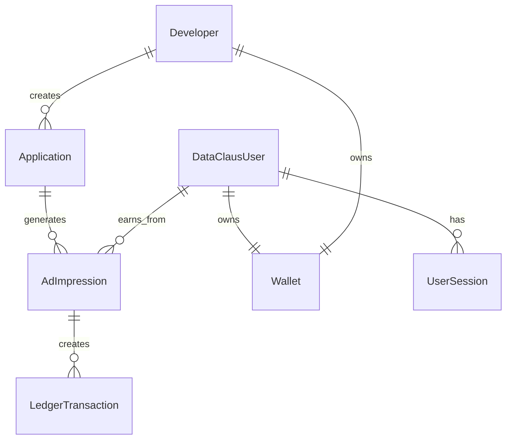

# DataClaus Platform - Implementation Plan (Revised)

## Key Clarification: Unified User System

> [!IMPORTANT] > **Users are the same everywhere.** A user who logs into TikTok Clone (or any developer app) with their DataClaus account is the **SAME user** who logs into the DataClaus web portal. One account, one wallet, one identity.

```
┌─────────────────────────────────────────────────────────────────────┐
│                     DataClaus User (End User)                       │
├─────────────────────────────────────────────────────────────────────┤
│  Phone: +1234567890                                                  │
│  Email: user@example.com                                             │
│  Wallet: $12.50 earned                                               │
├─────────────────────────────────────────────────────────────────────┤
│                                                                      │
│  ┌──────────────┐  ┌──────────────┐  ┌──────────────┐              │
│  │ TikTok Clone │  │ Fitness App  │  │ DataClaus    │              │
│  │ (Mobile App) │  │ (Mobile App) │  │ Web Portal   │              │
│  │              │  │              │  │              │              │
│  │ Uses SDK to  │  │ Uses SDK to  │  │ Views        │              │
│  │ login with   │  │ login with   │  │ earnings,    │              │
│  │ DataClaus    │  │ DataClaus    │  │ withdraws    │              │
│  │ credentials  │  │ credentials  │  │ money        │              │
│  └──────────────┘  └──────────────┘  └──────────────┘              │
│                                                                      │
└─────────────────────────────────────────────────────────────────────┘
```

---

## Entity Architecture

### Platform Entities (Staff/Business)

| Entity        | Role              | Description                         |
| ------------- | ----------------- | ----------------------------------- |
| **Admin**     | Platform operator | Full access, can impersonate anyone |
| **Developer** | App creator       | Creates apps, earns from user data  |
| **Buyer**     | Data purchaser    | Buys data streams (future phase)    |

### User Entity (End Users)

| Entity            | Role                   | Description                                    |
| ----------------- | ---------------------- | ---------------------------------------------- |
| **DataClausUser** | App user + Portal user | Single identity across all apps and web portal |

### Relationships



---

## No Mock Data Policy

> [!CAUTION] > **ZERO MOCK DATA.** Every feature must connect to real backend services. No simulations, no dev mode bypasses, no hardcoded test values.

### What This Means

| ❌ Forbidden                 | ✅ Required                                          |
| ---------------------------- | ---------------------------------------------------- |
| `if (isDev) return mockData` | Real API calls always                                |
| Hardcoded OTP "1234"         | SMS gateway integration (or console logging for dev) |
| Fake ad revenue values       | Real impression tracking, real calculations          |
| Simulated reCAPTCHA          | Real Google reCAPTCHA Enterprise calls               |

---

## Phase 1: DataClaus User System

### 1.1 Database Entity

#### [NEW] `dataclaus-api/internal/core/domain/dataclaus_user.go`

```go
package domain

import (
    "time"
    "github.com/google/uuid"
)

// DataClausUser represents an end-user of the platform
// This is the SAME user across all developer apps AND the web portal
type DataClausUser struct {
    ID                uuid.UUID  `gorm:"type:uuid;primary_key;default:gen_random_uuid()"`

    // Authentication
    Phone             string     `gorm:"uniqueIndex;not null"` // Primary login method
    PhoneVerified     bool       `gorm:"default:false"`
    Email             *string    `gorm:"uniqueIndex"`          // Optional, for web login
    EmailVerified     bool       `gorm:"default:false"`
    PasswordHash      *string    // For web portal login (optional)

    // Profile
    DisplayName       *string
    AvatarURL         *string

    // Device fingerprinting for fraud detection
    DeviceFingerprints []DeviceFingerprint `gorm:"foreignKey:UserID"`

    // Financial
    WalletID          uuid.UUID  `gorm:"type:uuid"`
    Wallet            Wallet     `gorm:"foreignKey:WalletID"`

    // Quality & Earnings
    QualityScore      float64    `gorm:"default:0.5"`  // 0.0 to 1.0
    TotalEarned       float64    `gorm:"default:0"`
    PendingBalance    float64    `gorm:"default:0"`    // Below threshold amounts

    // Metadata
    LastLoginAt       *time.Time
    LastActiveAt      *time.Time
    CreatedAt         time.Time
    UpdatedAt         time.Time
}

// DeviceFingerprint stores device info for fraud detection
type DeviceFingerprint struct {
    ID        uuid.UUID `gorm:"type:uuid;primary_key;default:gen_random_uuid()"`
    UserID    uuid.UUID `gorm:"type:uuid;index"`
    Hash      string    `gorm:"index"` // Hashed fingerprint
    Platform  string    // ios, android, web
    LastSeenAt time.Time
    CreatedAt time.Time
}

// OTPCode stores pending OTP verifications
type OTPCode struct {
    ID        uuid.UUID `gorm:"type:uuid;primary_key;default:gen_random_uuid()"`
    Phone     string    `gorm:"index;not null"`
    Code      string    `gorm:"not null"` // Hashed OTP
    ExpiresAt time.Time
    Used      bool      `gorm:"default:false"`
    CreatedAt time.Time
}

// UserSession stores active user sessions
type UserSession struct {
    ID           uuid.UUID `gorm:"type:uuid;primary_key;default:gen_random_uuid()"`
    UserID       uuid.UUID `gorm:"type:uuid;index"`
    Token        string    `gorm:"uniqueIndex"` // JWT or session token
    DeviceInfo   string    // JSON device info
    IPAddress    string
    ExpiresAt    time.Time
    CreatedAt    time.Time
}
```

---

### 1.2 Repository Layer

#### [NEW] `dataclaus-api/internal/adapters/repository/postgres/dataclaus_user_repo.go`

```go
type DataClausUserRepository interface {
    Create(ctx context.Context, user *domain.DataClausUser) error
    GetByID(ctx context.Context, id uuid.UUID) (*domain.DataClausUser, error)
    GetByPhone(ctx context.Context, phone string) (*domain.DataClausUser, error)
    GetByEmail(ctx context.Context, email string) (*domain.DataClausUser, error)
    Update(ctx context.Context, user *domain.DataClausUser) error

    // OTP methods
    CreateOTP(ctx context.Context, otp *domain.OTPCode) error
    GetValidOTP(ctx context.Context, phone, code string) (*domain.OTPCode, error)
    MarkOTPUsed(ctx context.Context, id uuid.UUID) error

    // Session methods
    CreateSession(ctx context.Context, session *domain.UserSession) error
    GetSession(ctx context.Context, token string) (*domain.UserSession, error)
    DeleteSession(ctx context.Context, token string) error
    DeleteUserSessions(ctx context.Context, userID uuid.UUID) error
}
```

---

### 1.3 Service Layer

#### [NEW] `dataclaus-api/internal/core/services/dataclaus_user_service.go`

```go
type DataClausUserService interface {
    // OTP Authentication
    RequestOTP(ctx context.Context, phone string) error
    VerifyOTP(ctx context.Context, phone, code string) (*LoginResponse, error)

    // Session Management
    ValidateToken(ctx context.Context, token string) (*domain.DataClausUser, error)
    RefreshToken(ctx context.Context, token string) (*LoginResponse, error)
    Logout(ctx context.Context, token string) error

    // Profile
    GetProfile(ctx context.Context, userID uuid.UUID) (*UserProfile, error)
    UpdateProfile(ctx context.Context, userID uuid.UUID, req UpdateProfileRequest) error

    // Earnings
    GetEarnings(ctx context.Context, userID uuid.UUID) (*UserEarnings, error)
    GetTransactionHistory(ctx context.Context, userID uuid.UUID, page, limit int) ([]Transaction, error)
}

type LoginResponse struct {
    User         UserProfile `json:"user"`
    AccessToken  string      `json:"access_token"`
    RefreshToken string      `json:"refresh_token"`
    ExpiresIn    int         `json:"expires_in"` // seconds
}
```

---

### 1.4 HTTP Handlers

#### [NEW] `dataclaus-api/internal/adapters/http/dataclaus_user_auth.go`

Endpoints for user authentication:

| Method | Endpoint                 | Description                |
| ------ | ------------------------ | -------------------------- |
| POST   | `/auth/user/request-otp` | Send OTP to phone          |
| POST   | `/auth/user/verify-otp`  | Verify OTP, create session |
| POST   | `/auth/user/refresh`     | Refresh access token       |
| POST   | `/auth/user/logout`      | Invalidate session         |
| GET    | `/auth/user/me`          | Get current user profile   |
| PUT    | `/auth/user/profile`     | Update profile             |

---

### 1.5 Update Server Routes

#### [MODIFY] `dataclaus-api/internal/adapters/http/server.go`

Add new handler and routes:

```go
type Handlers struct {
    // ... existing handlers
    DataClausUser *DataClausUserHandler // NEW
}

// In NewServer:
// User Authentication (End Users)
userAuth := e.Group("/auth/user")
userAuth.POST("/request-otp", h.DataClausUser.RequestOTP)
userAuth.POST("/verify-otp", h.DataClausUser.VerifyOTP)
userAuth.POST("/refresh", h.DataClausUser.RefreshToken)
userAuth.POST("/logout", h.DataClausUser.Logout)
userAuth.GET("/me", h.DataClausUser.GetMe, userAuthMiddleware)
userAuth.PUT("/profile", h.DataClausUser.UpdateProfile, userAuthMiddleware)

// User Earnings
e.GET("/users/:userId/earnings", h.DataClausUser.GetEarnings, userAuthMiddleware)
e.GET("/users/:userId/transactions", h.DataClausUser.GetTransactions, userAuthMiddleware)
```

---

## Phase 2: Mobile SDK Authentication

### 2.1 SDK Auth Module

#### [NEW] `packages/sdk-react-native/src/auth/DataClausAuth.ts`

```typescript
export interface DataClausAuthConfig {
  apiUrl: string; // DataClaus API URL
  siteKey: string; // reCAPTCHA site key
}

export interface AuthState {
  user: DataClausUser | null;
  accessToken: string | null;
  isLoading: boolean;
  isAuthenticated: boolean;
}

export interface DataClausUser {
  id: string;
  phone: string;
  displayName?: string;
  avatarUrl?: string;
  qualityScore: number;
  totalEarned: number;
  pendingBalance: number;
}

export class DataClausAuth {
  private config: DataClausAuthConfig;
  private state: AuthState;

  constructor(config: DataClausAuthConfig);

  // OTP Flow
  async requestOTP(phone: string, recaptchaToken: string): Promise<void>;
  async verifyOTP(phone: string, otp: string): Promise<LoginResult>;

  // Session
  async refreshToken(): Promise<void>;
  async logout(): Promise<void>;

  // Token for API calls
  getAccessToken(): string | null;
  getUser(): DataClausUser | null;
  isAuthenticated(): boolean;

  // Persistence
  async restoreSession(): Promise<boolean>;
}
```

---

### 2.2 React Hooks

#### [NEW] `packages/sdk-react-native/src/auth/useDataClausAuth.ts`

```typescript
export function useDataClausAuth(): {
  user: DataClausUser | null;
  isAuthenticated: boolean;
  isLoading: boolean;
  requestOTP: (phone: string) => Promise<void>;
  verifyOTP: (phone: string, otp: string) => Promise<void>;
  logout: () => Promise<void>;
  refreshEarnings: () => Promise<void>;
};
```

---

### 2.3 Auth Provider

#### [NEW] `packages/sdk-react-native/src/auth/DataClausAuthProvider.tsx`

```typescript
export function DataClausAuthProvider({
  children,
  config,
  onAuthStateChange,
}: {
  children: React.ReactNode;
  config: DataClausAuthConfig;
  onAuthStateChange?: (state: AuthState) => void;
}): JSX.Element;
```

---

## Phase 3: Ad Revenue System (Real Implementation)

### 3.1 Ad Impression Entity

#### [NEW] `dataclaus-api/internal/core/domain/ad_impression.go`

```go
type AdImpression struct {
    ID            uuid.UUID `gorm:"type:uuid;primary_key;default:gen_random_uuid()"`

    // Relationships
    ApplicationID uuid.UUID `gorm:"type:uuid;index;not null"`
    UserID        uuid.UUID `gorm:"type:uuid;index;not null"`

    // Ad Details
    AdType        string    `gorm:"not null"` // banner, interstitial, rewarded
    AdUnitID      string    // Google AdMob unit ID
    AdNetworkName string    `gorm:"default:'admob'"`

    // Revenue (in USD)
    GrossRevenue  float64   `gorm:"not null"` // Total from ad network
    UserShare     float64   `gorm:"not null"` // User's portion
    DevShare      float64   `gorm:"not null"` // Developer's portion
    PlatformFee   float64   `gorm:"not null"` // Platform's 5%

    // Distribution Status
    Distributed   bool      `gorm:"default:false"`
    DistributedAt *time.Time

    // Metadata
    Currency      string    `gorm:"default:'USD'"`
    IPAddress     string
    DeviceInfo    string    // JSON
    CreatedAt     time.Time
}
```

---

### 3.2 Ads Service

#### [NEW] `dataclaus-api/internal/core/services/ads_service.go`

```go
type AdsService interface {
    // Record impression and distribute revenue
    RecordImpression(ctx context.Context, req RecordImpressionRequest) (*ImpressionResult, error)

    // Get ad config for application
    GetAdConfig(ctx context.Context, appID uuid.UUID) (*AdConfig, error)

    // Revenue summaries
    GetAppRevenueSummary(ctx context.Context, appID uuid.UUID, period string) (*RevenueSummary, error)
    GetUserRevenueSummary(ctx context.Context, userID uuid.UUID, period string) (*RevenueSummary, error)
}

type RecordImpressionRequest struct {
    ApplicationID uuid.UUID
    UserID        uuid.UUID
    AdType        string
    GrossRevenue  float64
    AdUnitID      string
    IPAddress     string
    DeviceInfo    string
}

type ImpressionResult struct {
    ImpressionID  uuid.UUID `json:"impression_id"`
    UserShare     float64   `json:"user_share"`
    DevShare      float64   `json:"dev_share"`
    PlatformFee   float64   `json:"platform_fee"`
    UserNewTotal  float64   `json:"user_new_total"`
}
```

---

## Phase 4: reCAPTCHA Enterprise Backend Proxy

### 4.1 reCAPTCHA Handler

#### [NEW] `dataclaus-api/internal/adapters/http/recaptcha.go`

```go
type RecaptchaHandler struct {
    client *recaptchaenterprise.Client
    config RecaptchaConfig
}

type RecaptchaConfig struct {
    ProjectID      string
    SiteKey        string
    ScoreThreshold float64
}

// Endpoints
func (h *RecaptchaHandler) Verify(c echo.Context) error
func (h *RecaptchaHandler) Annotate(c echo.Context) error
```

---

### 4.2 Environment Configuration

#### [MODIFY] `dataclaus-api/internal/config/config.go`

```go
type Config struct {
    // ... existing

    // reCAPTCHA Enterprise
    RecaptchaProjectID      string
    RecaptchaSiteKey        string
    RecaptchaScoreThreshold float64
    GoogleCredentialsPath   string // Path to service account JSON
}
```

---

## Phase 5: Web Portal User Dashboard

### 5.1 User Pages

#### [NEW] `dataclaus-web/src/app/(user)/layout.tsx`

User-specific layout with navigation.

#### [NEW] `dataclaus-web/src/app/(user)/earnings/page.tsx`

- Current balance (available + pending)
- Quality score with explanation
- Earnings chart over time
- Breakdown by app

#### [NEW] `dataclaus-web/src/app/(user)/history/page.tsx`

- Transaction history table
- Filter by type (ad revenue, withdrawal, etc.)
- Export functionality

#### [NEW] `dataclaus-web/src/app/(user)/settings/page.tsx`

- Profile settings
- Linked devices
- Withdrawal settings (future)

---

## Phase 6: Update Demo Apps

### 6.1 TikTok Mobile

#### [MODIFY] `apps/tiktok-mobile/app/_layout.tsx`

Replace custom auth with DataClaus SDK auth:

```typescript
import { DataClausAuthProvider } from "@dataclaus/sdk-react-native";

export default function RootLayout() {
  return (
    <DataClausAuthProvider
      config={{
        apiUrl: process.env.EXPO_PUBLIC_DATACLAUS_API_URL!,
        siteKey: process.env.EXPO_PUBLIC_RECAPTCHA_SITE_KEY!,
      }}
    >
      <Stack />
    </DataClausAuthProvider>
  );
}
```

---

### 6.2 TikTok Backend

#### [MODIFY] `apps/tiktok-backend/src/routes/auth.ts`

Remove custom auth, add DataClaus token verification:

```typescript
import { DataClausClient } from "@dataclaus/sdk-node";

const dataclaus = new DataClausClient({
  apiKey: process.env.DATACLAUS_API_KEY!,
  apiUrl: process.env.DATACLAUS_API_URL!,
  developerId: process.env.DATACLAUS_DEVELOPER_ID!,
});

// Middleware to verify DataClaus user token
async function verifyDataClausUser(req, res, next) {
  const token = req.headers.authorization?.replace("Bearer ", "");
  if (!token) return res.status(401).json({ error: "No token" });

  const user = await dataclaus.verifyUserToken(token);
  req.dataclausUser = user;
  next();
}
```

---

## Implementation Order

1. **Phase 1.1-1.5**: DataClaus User backend (entities, repos, services, handlers)
2. **Phase 3**: Ad Impression system (needs user system first)
3. **Phase 4**: reCAPTCHA proxy (needed for mobile auth)
4. **Phase 2**: Mobile SDK auth module
5. **Phase 5**: Web portal user pages
6. **Phase 6**: Update demo apps

---

## Files to Create/Modify Summary

### New Files (Backend)

- `dataclaus-api/internal/core/domain/dataclaus_user.go`
- `dataclaus-api/internal/adapters/repository/postgres/dataclaus_user_repo.go`
- `dataclaus-api/internal/core/services/dataclaus_user_service.go`
- `dataclaus-api/internal/adapters/http/dataclaus_user_auth.go`
- `dataclaus-api/internal/core/domain/ad_impression.go`
- `dataclaus-api/internal/adapters/repository/postgres/ad_impression_repo.go`
- `dataclaus-api/internal/core/services/ads_service.go`
- `dataclaus-api/internal/adapters/http/ads.go`
- `dataclaus-api/internal/adapters/http/recaptcha.go`

### New Files (SDK)

- `sdk-react-native/src/auth/DataClausAuth.ts`
- `sdk-react-native/src/auth/useDataClausAuth.ts`
- `sdk-react-native/src/auth/DataClausAuthProvider.tsx`
- `sdk-react-native/src/auth/index.ts`

### New Files (Web)

- `dataclaus-web/src/app/(user)/layout.tsx`
- `dataclaus-web/src/app/(user)/earnings/page.tsx`
- `dataclaus-web/src/app/(user)/history/page.tsx`
- `dataclaus-web/src/app/(user)/settings/page.tsx`

### Modified Files

- `dataclaus-api/internal/adapters/http/server.go`
- `dataclaus-api/internal/database/migrations.go`
- `dataclaus-api/cmd/api/main.go`
- `sdk-react-native/src/index.ts`
- `tiktok-mobile/app/_layout.tsx`
- `tiktok-backend/src/routes/auth.ts`

---

_Ready to proceed with Phase 1 implementation._
