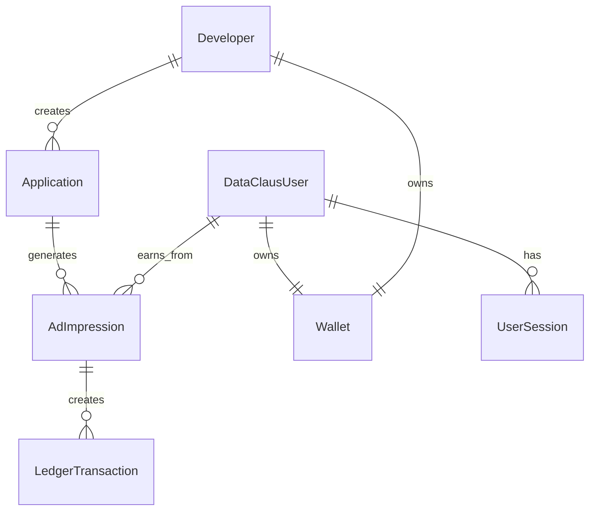

# DataClaus Platform - Implementation Plan (NestJS Edition)

## Key Clarification: Unified User System

> [!IMPORTANT] > **Users are the same everywhere.** A user who logs into TikTok Clone (or any developer app) with their DataClaus account is the **SAME user** who logs into the DataClaus web portal. One account, one wallet, one identity.

```
┌─────────────────────────────────────────────────────────────────────┐
│                     DataClaus User (End User)                       │
├─────────────────────────────────────────────────────────────────────┤
│  Phone: +1234567890                                                  │
│  Email: user@example.com                                             │
│  Wallet: $12.50 earned                                               │
├─────────────────────────────────────────────────────────────────────┤
│                                                                      │
│  ┌──────────────┐  ┌──────────────┐  ┌──────────────┐              │
│  │ TikTok Clone │  │ Fitness App  │  │ DataClaus    │              │
│  │ (Mobile App) │  │ (Mobile App) │  │ Web Portal   │              │
│  │              │  │              │  │              │              │
│  │ Uses SDK to  │  │ Uses SDK to  │  │ Views        │              │
│  │ login with   │  │ login with   │  │ earnings,    │              │
│  │ DataClaus    │  │ DataClaus    │  │ withdraws    │              │
│  │ credentials  │  │ credentials  │  │ money        │              │
│  └──────────────┘  └──────────────┘  └──────────────┘              │
│                                                                      │
└─────────────────────────────────────────────────────────────────────┘
```

---

## Entity Architecture (TypeORM)

### Platform Entities (Staff/Business)

| Entity        | Role              | Description                         |
| ------------- | ----------------- | ----------------------------------- |
| **Admin**     | Platform operator | Full access, can impersonate anyone |
| **Developer** | App creator       | Creates apps, earns from user data  |
| **Buyer**     | Data purchaser    | Buys data streams (future phase)    |

### User Entity (End Users)

| Entity            | Role                   | Description                                    |
| ----------------- | ---------------------- | ---------------------------------------------- |
| **DataClausUser** | App user + Portal user | Single identity across all apps and web portal |

### Relationships



---

## No Mock Data Policy

> [!CAUTION] > **ZERO MOCK DATA.** Every feature must connect to real backend services. No simulations, no dev mode bypasses, no hardcoded test values.

### What This Means

| ❌ Forbidden                 | ✅ Required                                          |
| ---------------------------- | ---------------------------------------------------- |
| `if (isDev) return mockData` | Real API calls always                                |
| Hardcoded OTP "1234"         | SMS gateway integration (or console logging for dev) |
| Fake ad revenue values       | Real impression tracking, real calculations          |
| Simulated reCAPTCHA          | Real Google reCAPTCHA Enterprise calls               |

---

## Phase 1: DataClaus User System (NestJS)

### 1.1 Database Entity

#### [NEW] `apps/dataclaus-nestjs-api/src/dataclaus-user/entities/dataclaus-user.entity.ts`

```typescript
import { Entity, PrimaryGeneratedColumn, Column, CreateDateColumn, UpdateDateColumn, OneToOne, JoinColumn } from 'typeorm';
import { Wallet } from '../../wallet/entities/wallet.entity';

@Entity('dataclaus_users')
export class DataClausUser {
  @PrimaryGeneratedColumn('uuid')
  id: string;

  // Authentication
  @Column({ unique: true })
  phone: string;

  @Column({ default: false })
  phoneVerified: boolean;

  @Column({ unique: true, nullable: true })
  email: string;

  @Column({ default: false })
  emailVerified: boolean;

  @Column({ nullable: true })
  passwordHash: string;

  // Profile
  @Column({ nullable: true })
  displayName: string;

  @Column({ nullable: true })
  avatarUrl: string;

  // Financial
  @Column('uuid')
  walletId: string;

  @OneToOne(() => Wallet)
  @JoinColumn({ name: 'walletId' })
  wallet: Wallet;

  // Quality & Earnings
  @Column('decimal', { precision: 5, scale: 4, default: 0.5 })
  qualityScore: number;

  @Column('decimal', { precision: 12, scale: 4, default: 0 })
  totalEarned: number;

  @Column('decimal', { precision: 12, scale: 4, default: 0 })
  pendingBalance: number;

  // Metadata
  @Column({ type: 'timestamp', nullable: true })
  lastLoginAt: Date;

  @CreateDateColumn()
  createdAt: Date;

  @UpdateDateColumn()
  updatedAt: Date;
}
```

---

### 1.2 Service Layer

#### [NEW] `apps/dataclaus-nestjs-api/src/dataclaus-user/dataclaus-user.service.ts`

```typescript
import { Injectable } from '@nestjs/common';
import { InjectRepository } from '@nestjs/typeorm';
import { Repository } from 'typeorm';
import { DataClausUser } from './entities/dataclaus-user.entity';

@Injectable()
export class DataClausUserService {
  constructor(
    @InjectRepository(DataClausUser)
    private userRepository: Repository<DataClausUser>,
  ) {}

  async findByPhone(phone: string): Promise<DataClausUser | undefined> {
    return this.userRepository.findOne({ where: { phone } });
  }

  // OTP Logic
  async requestOtp(phone: string): Promise<void> { /* ... */ }
  async verifyOtp(phone: string, code: string): Promise<DataClausUser> { /* ... */ }
}
```

---

### 1.3 Controllers & Auth

#### [NEW] `apps/dataclaus-nestjs-api/src/auth/auth.controller.ts`

NestJS controllers handle the routing and guard logic (JWT & HMAC).

| Method | Endpoint                 | Description                |
| ------ | ------------------------ | -------------------------- |
| POST   | `/api/auth/request-otp`  | Send OTP to phone          |
| POST   | `/api/auth/verify-otp`   | Verify OTP, return JWT     |
| POST   | `/api/auth/refresh`      | Refresh access token       |
| GET    | `/api/auth/me`           | Get current user profile   |

*(Note: Data Ingestion endpoints are protected by `HmacAuthGuard`)*

---

## Phase 2: Mobile SDK Authentication

### 2.1 SDK Auth Module

#### [NEW] `packages/sdk-react-native/src/auth/DataClausAuth.ts`

```typescript
export interface DataClausAuthConfig {
  apiUrl: string; // DataClaus API URL
  siteKey: string; // reCAPTCHA site key
}

export class DataClausAuth {
  // OTP Flow
  async requestOTP(phone: string, recaptchaToken: string): Promise<void>;
  async verifyOTP(phone: string, otp: string): Promise<LoginResult>;
  
  // HMAC Signatures for API integration
  signPayload(payload: any, secret: string): string;
}
```

---

## Phase 3: Ad Revenue System (NestJS & Double-Entry Ledger)

### 3.1 Ad Impression Entity

#### [NEW] `apps/dataclaus-nestjs-api/src/ads/entities/ad-impression.entity.ts`

```typescript
@Entity('ad_impressions')
export class AdImpression {
  @PrimaryGeneratedColumn('uuid')
  id: string;

  @Column('uuid')
  applicationId: string;

  @Column('uuid')
  userId: string;

  @Column()
  adType: string; // banner, interstitial, rewarded

  @Column('decimal', { precision: 10, scale: 6 })
  grossRevenue: number;

  @Column('decimal', { precision: 10, scale: 6 })
  userShare: number;

  @Column('decimal', { precision: 10, scale: 6 })
  devShare: number;

  @Column('decimal', { precision: 10, scale: 6 })
  platformFee: number;

  @Column({ default: false })
  distributed: boolean;

  @CreateDateColumn()
  createdAt: Date;
}
```

---

### 3.2 Ads Service & Ledger Integration

#### [NEW] `apps/dataclaus-nestjs-api/src/ads/ads.service.ts`

```typescript
@Injectable()
export class AdsService {
  constructor(
    private walletService: WalletService,
    private ledgerService: LedgerService,
  ) {}

  @Transactional() // All financial operations must be atomic
  async recordImpression(req: RecordImpressionDto): Promise<ImpressionResult> {
    // 1. Calculate shares based on Application.userSharePercent
    // 2. Insert AdImpression
    // 3. Create LedgerTransaction entries (Double-Entry)
    //    - Debit Platform/AdNetwork Wallet
    //    - Credit User Wallet
    //    - Credit Developer Wallet
    // 4. Return result
  }
}
```

---

## Implementation Order

1. **Phase 1**: DataClaus User backend (Entities, Services, Controllers in NestJS)
2. **Phase 2**: Ad Impression system & Ledger Atomicity
3. **Phase 3**: HMAC Guards for Webhook and SDK security (`HmacAuthGuard`)
4. **Phase 4**: Mobile SDK auth module updates
5. **Phase 5**: Web portal user pages
6. **Phase 6**: Update demo apps (TikTok clone to use new NestJS API)

---

## Files to Create/Modify Summary (NestJS Stack)

### Backend (`apps/dataclaus-nestjs-api`)
- `src/dataclaus-user/entities/dataclaus-user.entity.ts`
- `src/dataclaus-user/dataclaus-user.service.ts`
- `src/auth/auth.controller.ts`
- `src/auth/guards/hmac-auth.guard.ts` (Critical for SDK)
- `src/ads/entities/ad-impression.entity.ts`
- `src/ads/ads.service.ts`
- `src/ledger/ledger.service.ts`

### SDK (`packages/sdk-react-native`)
- `src/auth/DataClausAuth.ts`
- `src/utils/hmac.ts`

### Web (`apps/dataclaus-web`)
- `src/app/(user)/layout.tsx`
- `src/app/(user)/earnings/page.tsx`
- `src/app/(user)/history/page.tsx`

_Ready to proceed with Phase 1 implementation under NestJS architecture._
