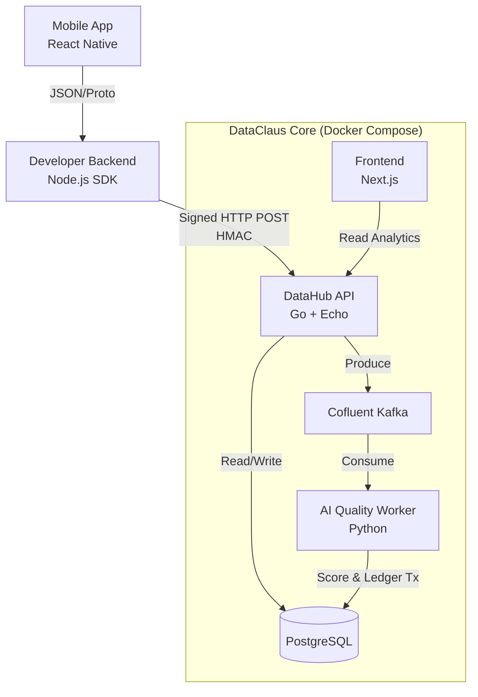

# System Patterns

## Architecture: Event-Driven Microservices

The system is designed for high throughput ingestion and asynchronous processing.

## Technical Decisions & Patterns

#### 0. Git Output Analysis and Interpretation

When a user provides Git output (e.g., `git status` or `git diff`), always follow this format:

1.  **[Summary]** Summarize the state of the user's branch in a single sentence.
2.  **[Changes]** List the main files changed and the type of change (new, modified, deleted).
3.  **[Recommendation]** Clearly state the next step that should be taken, adhering to the Project Git Policy (`gitPolicy.md`) (e.g., commit, rebase, open a PR).

### 1. Database Access: GORM

- **ORM:** GORM is used instead of raw SQL or sqlc.
- **Pattern:** Code-first. Go structs define the DB schema.
- **Migration:** `db.AutoMigrate()` keeps schema synced on startup.
- **Driver:** `pgx` (via `gorm.io/driver/postgres`) is used for high-performance PostgreSQL connectivity.

### 2. API Framework

- **Router:** Echo chosen for speed, minimalism, and strong middleware support.
- **Middleware Pipeline:**
  - **Logger:** Integrated with `zerolog` for structured JSON logs.
  - **Recover:** Prevents server crashes on panics.
  - **HMAC Validator:** Custom middleware for `/v1/ingest`; recalculates HMAC signature and rejects invalid requests before handler execution.

### 3. Asynchronous Processing (The Buffer Pattern)

- **Ingest Endpoint `/v1/ingest`:**

  - Non-blocking by design.
  - Validates request (Auth + Schema).
  - Publishes payload to Kafka (`ingest.raw_data`).
  - Returns **202 Accepted** immediately.
  - Does **not** write to the DB synchronously (except minimal caching/auth lookup).

- **Worker (Python):**
  - Kafka consumer.
  - Performs heavy computation (Fraud Logic).
  - Executes all transactional writes (Ledger updates).

### 4. Ledger Integrity (The Financial Core)

- **Atomicity:** All financial updates occur inside one DB transaction (Worker controlled).
  - Campaign budget decrement
  - Wallet increment
  - Transaction Log creation
- **Double-Entry (Simulated):**
  - Every credit to a user/developer wallet is matched by a debit from a Buyer/Platform/Faucet wallet.
  - Ensures no money is created arbitrarily.

### 5. Fraud Detection Strategy (Unsupervised Learning)

- **Model:** Isolation Forest (Scikit-learn).
- **Feature Engineering:**
  - **Jitter:** Stddev of acceleration magnitude (humans shake, bots don’t).
  - **Time Variance:** Variance in timestamp deltas (humans irregular, scripts precise).
  - **Stroke Efficiency:** Displacement vs. path distance from touch data.
- **Logic:** No pre-trained models; the system analyzes each incoming batch and detects outliers relative to human-like behavior.
